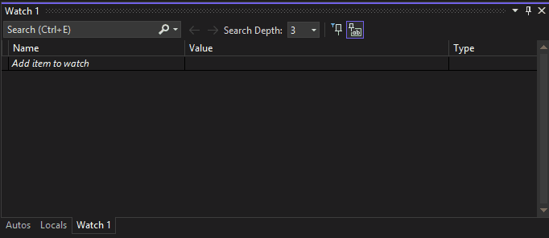

# NatVisFuncEvalExample

Function evaluation (func eval for short) is when a debugger hijacks the current (stopped) thread, and
forces it to run a function. Native func eval is inherently dangerous (see reasons below), and so it
should be avoided any time it can. Unfortunately, some frameworks were not built to allow objects
to be inspected without running code. This project shows how you can use func eval in natvis.

## Problems with func eval

Here are the most severe problems with native func eval:

1. Deadlocks - when the debugger performs a func eval, it will suspend all threads except the
evaluating thread. This will dead lock if any of these suspended threads is holding a lock. This
includes the OS's heap allocation lock, so any function that allocates memory on the heap will
sometimes deadlock. The debugger will attempt to resume the background threads if we discover
the evaluated function is waiting on a lock. But this process is slow and will allow all
background threads to run, which can greatly interfere with multithreaded debugging.
2. Variables may be invalid, causing crashes - compilers will tell a debugger where variables are
located, but not if that memory has actually been initialized. For optimized code, this is
even worse where the storage location might just be wrong. Debuggers can cleanly handle fails
reading memory, so this isn't a significant problem when variables and being decoded from the
debugger process. But with func-eval, there is no way for code to defend itself against
invalid memory. The best case scenario is that the function being evaluated crashes, and
the debugger detects the exception and aborts the func eval. But it is also possible that the
memory referenced exists, but just points to something else and this causes a undebuggable
heap corruption.

## Demo

## How this works in brief

- ExampleClass.natvis tells the debugger how to format a type, `ExampleClass` in this case
- The debugger detects that the natvis uses func-eval, so it blocks the initial evaluation, but allows it to be explicitly evaluated by the user